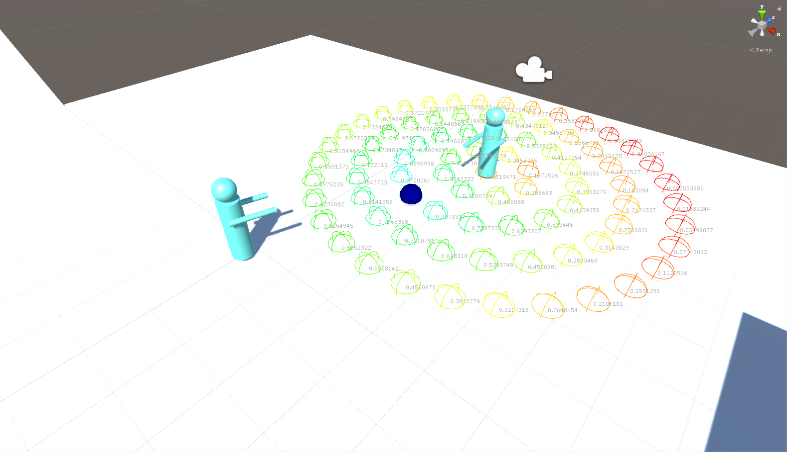
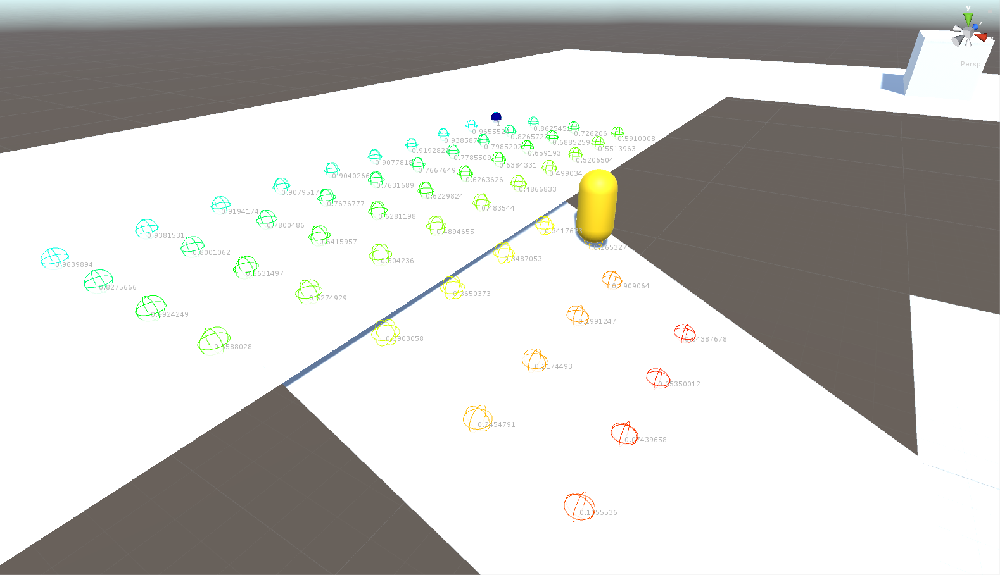

# Environment Query for Unity

## 概要
Unity用にEQS(Environment Query System)を実装してみた。Unreal Engine 4のソースコードを参考にしながら実装した。  
Youtube: [Environment Query for Unity](https://www.youtube.com/watch?v=TfslR2Iav30)

## EQSについての参考情報
- [キャラクターの人工知能のための戦術位置解析システム (CEDiL)](http://cedil.cesa.or.jp/cedil_sessions/view/1760)
- [スクウェア・エニックスにおける UNREAL ENGINE 4 を用いた人工知能技術の開発事例(Youtube)](https://www.youtube.com/watch?v=BV2GTGbSjq8)
- [はじめてのAI～ 愛のあるAIを作ろう(Youtube)](https://www.youtube.com/watch?v=gT8uuc0DxWk)
- [はじめてのAI～ 愛のあるAIを作ろう(SlideShare)](https://www.slideshare.net/masahikonakamura50/ai-ai-62023284)
- [Unreal Engine | Environment Query System ノードのリファレンス](http://api.unrealengine.com/JPN/Engine/AI/EnvironmentQuerySystem/NodeReference/index.html)
- Unreal Engine のソースコード
   - https://github.com/EpicGames/UnrealEngine/tree/release/Engine/Source/Runtime/AIModule/Private/EnvironmentQuery
   - https://github.com/EpicGames/UnrealEngine/tree/release/Engine/Source/Runtime/AIModule/Classes/EnvironmentQuery

## エディター拡張についての参考情報
- [Unity エディター拡張入門](http://anchan828.github.io/editor-manual/)
- [Editor拡張 ～これが出来ないと帰れま10～ 問題&ヒント](https://www.slideshare.net/keigoando/ss-26890598)
- [Editor拡張 ～これが出来ないと帰れま10～ 解答&解説](https://www.slideshare.net/keigoando/ss-26890597)
- [Unity Tutorial - Create a Custom Inspector with a Reorderable List: Part 1](https://www.youtube.com/watch?v=yeBggZz4OYM)
- [Unity: make your lists functional with ReorderableList](http://va.lent.in/unity-make-your-lists-functional-with-reorderablelist/)
